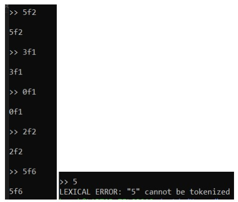
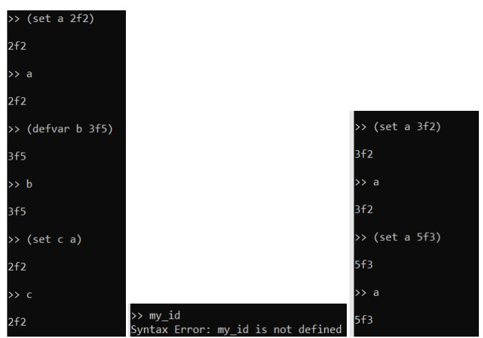
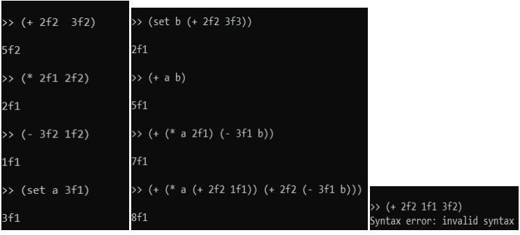
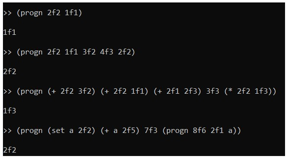
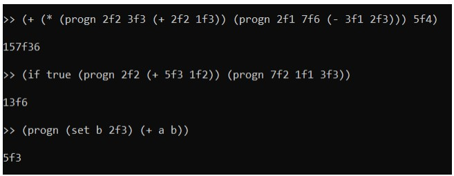
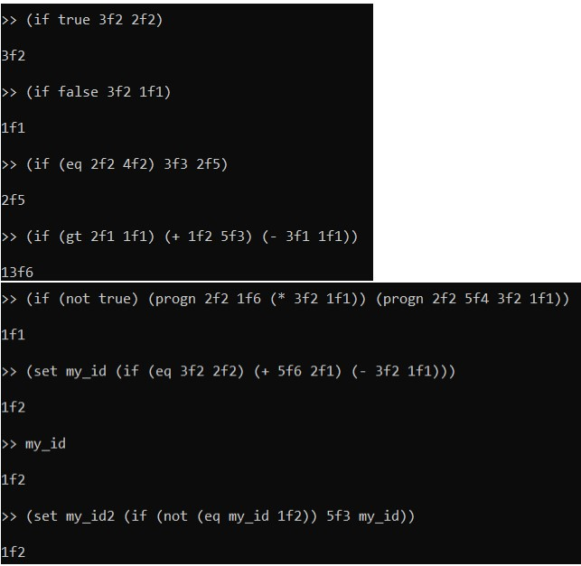
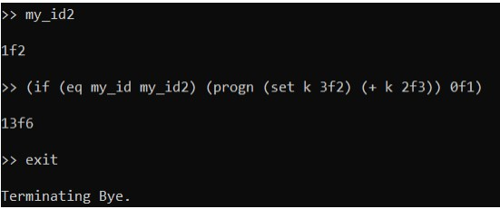
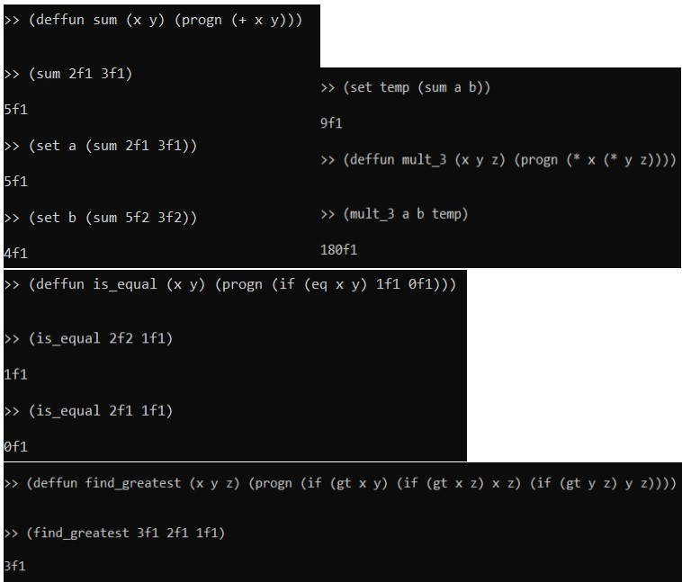
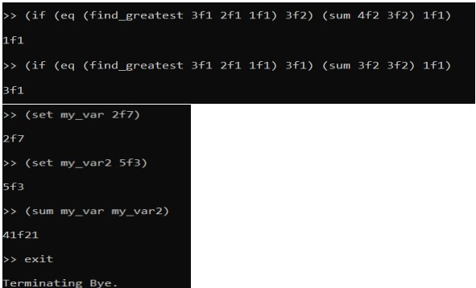
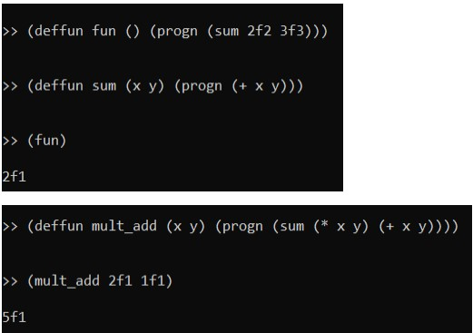

# General
- GPP is a programming language with lisp dialect, it uses prefix notation, and it has only fractional types.  
- It supports: variables, assignment expressions, boolean expressions, arithmetic expressions, function definitions, function calls.  

RUN
-------------------
```
clisp gpp_interpreter
```

# Test Results
## Type
-  The only type in the language is VALUEF. 
  
  
- f is used as fraction. Integer and other types are not recognized by this 
language. Both sides of f are unsigned integers. Language does operations with 
using nominator denominator of fraction.  

## Assignment/Variables  
- set, and defvar used for assignment 
expression. Language uses symbol table for association.  
  
  

## Arithmetic Expressions  
- These three operations are supported 
by the language, it also supports nested operations. Result is 
simplified after the calculation. Expression returns simplified results.
All these 3 operators, can take only 2 operand.  
  
  

## Expression List
- Expression List requires a progn keyword to indicate 
if it is expression list or not. In this way it can be differentiated from 
function calls by the interpreter.  
  
  
  
  
## Boolean Expressions
- If uses boolean expression for decision. 
Boolean expressions, returns invalid syntax when it is directly written 
to the interpreter without if expressions.
Internally it uses true, and false keywords, true and false keywords 
are also a boolean expression. If expression can take single 
expression or expression list.  
  
  
  

## Functions
- Function def requires deffun 
keyword id, arglist, and explist. After the definition it is associated with the 
function table. Each function call creates a local stack, variables are different 
from global symbol table. Each function call uses its local symbol table as 
referencing enviroment for variables. They can call other functions.  

  
  
  

